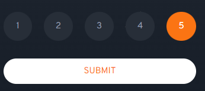

# Frontend Mentor - Interactive rating component solution

This is a solution to the [Interactive rating component challenge on Frontend Mentor](https://www.frontendmentor.io/challenges/interactive-rating-component-koxpeBUmI). Frontend Mentor challenges help you improve your coding skills by building realistic projects. 

## Table of contents

- [Overview](#overview)
  - [The challenge](#the-challenge)
  - [Screenshot](#screenshot)
  - [Links](#links)
- [My process](#my-process)
  - [Built with](#built-with)
  - [What I learned](#what-i-learned)
  - [Continued development](#continued-development)
  - [Useful resources](#useful-resources)
- [Author](#author)
- [Acknowledgments](#acknowledgments)

## Overview

### The challenge

Users should be able to:

- View the optimal layout for the app depending on their device's screen size
- See hover states for all interactive elements on the page
- Select and submit a number rating
- See the "Thank you" card state after submitting a rating

### Screenshot





### Links

- Solution URL: https://www.frontendmentor.io/solutions/interactive-rating-component-pFSI6pjtGF
- Live Site URL: https://jp-mainieri.github.io/a005/

## My process

### Built with

- Semantic HTML5 markup
- CSS custom properties
- Flexbox
- CSS Grid


### What I learned

```html
<section class="rating_question">
            </img>
               <article class="question_text">
                <h1>How did we do?</h1>
                <p>
                    Please let us know how we did with your support <br>
                    request. All feedback is appreciated to help us<br>
                    improve our offering!
                </p>
                </article>
                <nav>
                    <span class="grades" id="n1">1</span>
                    <span class="grades">2</span>
                    <span class="grades">3</span>
                    <span class="grades">4</span>
                    <span class="grades">5</span>
                </nav>
                <input type="button" value="submit" id="submit_">
           </section>
```
```css
#submit_:hover {
    background-color: white;
    color: hsl(25, 97%, 53%);
}

.grades:hover {
    background-color: hsl(217, 12%, 63%);
    color: whitesmoke;
}
.checked {
    background-color: hsl(25, 97%, 53% )!important;
    color: white !important;
}
```
```js
rating_cards.forEach((rating_card) => {
    rating_card.addEventListener("click", (e) => {
        const active=document.querySelector('.checked')
        if (active) {
            active.classList.remove("checked")
        }
        const card = e.target
        card.classList.add("checked")
        rate = e.target.innerText

    })
});
```